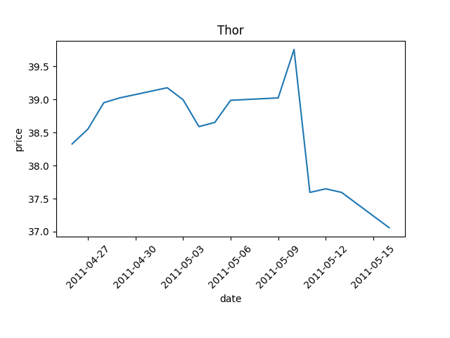

# Disney Stock Performance vs. Marvel MCU movie releases

## Hypothesis 

I am guessing that there is some sort of coorilation between box office successes
and Disney's stock price.

## The data

DIS historical stock data from yahoo finance from 2009 to present (April 2018)

MCU inflation adjusted movie releases and their earnin

## Results

It from visual examination, looks as though there was almost always a spike shortly after a MCU movie is released.

## Example: Thor 

## Roadmap:

- Calculate implied volitility leading up to and after a release
- generate a model for predicting future releases.
- Was there any broader trends that would render false positives?